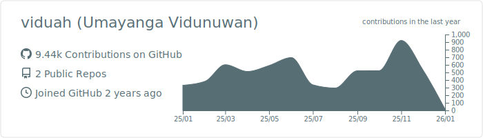

# Hi 👋, I'm Vidu

🚀 Software Engineer | Backend-Focused | API & System Builder  

I’m a software engineer with a strong focus on backend development.  
I enjoy building scalable APIs, clean business logic, and reliable systems that solve real-world problems.

---

## 🛠️ Tech Stack

### Backend
- PHP (Laravel)
- Node.js
- REST APIs
- JWT / Laravel Sanctum Authentication

### Frontend
- React
- JavaScript
- HTML / CSS

### Databases
- MySQL
- Firebase Firestore

### Tools & Platforms
- Git & GitHub
- AWS S3
- Firebase
- Postman

---

## 📌 What I’m Currently Working On
- 🔐 Secure authentication systems (JWT, Sanctum)
- 💳 Payment gateway integrations
- 🔔 Real-time notifications (Firebase FCM)
- 🎮 Real-time multiplayer application logic

---

## 🌱 Currently Learning
- System design & scalability
- Advanced Laravel architecture
- AI-assisted development workflows

---

## 📈 GitHub Stats

<!--  -->

---

## 🤝 Let’s Connect
- 💼 LinkedIn: https://linkedin.com/in/YOUR_PROFILE
- 📧 Email: your@email.com

---

⭐ *“Clean code, clear logic, scalable systems.”*
